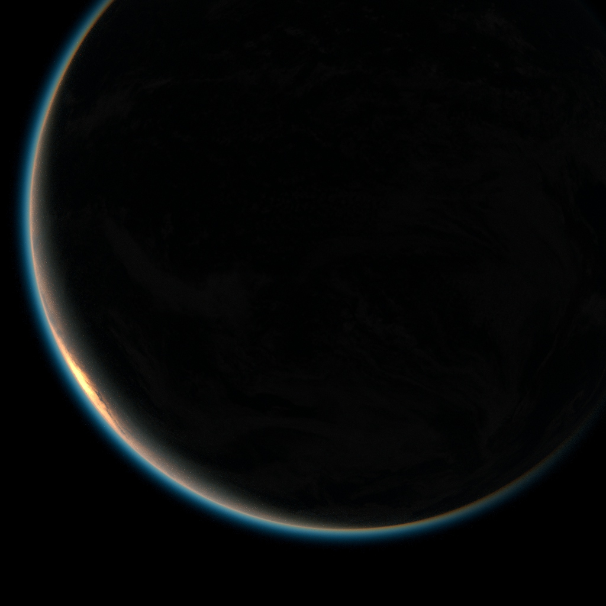

# JP Volume Layers
*Volume Shading Toolset for Side Effects Houdini's Karma CPU and Mantra renderers*

### Contents
- A new VOP struct type called **`VolumeLayer`**, with a VEX function library and VOP nodes to work with it
- Utility VOP nodes to make working with volume rendering a bit easier

### Description
I created these tools to help me render planetary atmospheres for planetarium productions at The American Museum of Natural History in New York (AMNH).

Atmospheres can be quite complex things to render, as there are multiple types of scattering, absorption and emission effects all in the same space.  Here are some examples of atmospheric mediums that can all potentially overlap on earth:
- dust
- gas
- haze
- water vapor
- aurora
- smoke
- clouds

Initial planet renders at AMNH used a volume object per-effect, which was correct but could be extremely slow.  Testing with the built-in **`ShadingLayer`** struct-based VOP nodes to combine different volume layers led to incorrect results when compared with the per-object method.

Fortunately, BSDF types in VEX are combined in a *probabilistic* way, and so you can weight them by their relative densities and then add them together.  The renderer will then sample each randomly based on their weight, thus emulating a proper mixing effect.

But this method requires lots of of utility nodes wired together in a VOP network, so I created a new struct type **`VolumeLayer`** to contain `F`, `density` and `emission`, and codified the proper combination functions into a VEX library.

#### How to Combine Volumes
The toolset is essentially a wrapper around the method described below.

In VEX, given two distinct volumetric mediums that you want to combine, the formula to do so is fairly straightforward:

```
bsdf f1; bsdf f2; // phase functions
vector d1; vector d2; // extinction (density)
vector em1; vector em2; // emission

// ***initialize volume data ***

// combine densities by adding them together
vector density = d1 + d2;
bsdf f = (f1 * (d1 / density)) + (f2 * (d2 / density));
vector emission = em1 + em2;

// Shader exports
// convert density to opacity *after* adding them together
Of = 1 - exp(-max(density * dPdz, 0));
F = f;
Ce = emission * dPdz;

```

In code this is fairly compact, but a VOP network becomes fairly messy if you need to do this with a few volume layers.
## Examples

*NOTE: The images below are not production renders - the atmosphere thickness is exaggerated to show the effect more clearly, and the texture resolution is very low (2048x1024).*

#### Earth

The following simplified render of Earth uses two **`volumelayershader`** VOPs merged together in a material network.  One **`volumelayershader`** VOP models blue, isotropic Rayleigh scattering for the gas.  Another **`volumelayershader`** VOP models dust and haze, which scatters all wavelengths of light in a strongly forward biased direction, away from the light source.  These two are combined by a simple **`volumeshadermerge`** VOP before being converted to the necessary material outputs with a **`volumelayercomputelighting`** VOP.

 
 


#### Mars

The render of Mars below uses three **`volumelayershader`** VOP nodes to model the atmosphere.  Like the Earth render above, one struct models blue Rayleigh scattering; however, the density of the atmosphere of Mars is only 5% that of Earth at sea level, so the blue scattering is nearly invisibly.  The second **`volumelayershader`** node models the effect of dust in the atmosphere.  The dust is the red of the Martian surface, which is forward scattering, mostly red, and slightly absorbing of green and blue colors. A third **`volumelayershader`** is also combined; this also models dust, but is a thicker layer lying in the low areas, such as the large canyon Valles Marinaris seen towards the center of the sphere.

Again, the thickness has been exagerrated to show the effect.

Here we see the strong foward scattering of the dust as the crescent edge brightens considerably:

 

As we move toward the sun's POV, the bright glow around the edge is diminished because most of the light travels away from us:

 


### What about MaterialX and XPU?
Because the VOP nodes in this toolset are VEX language VOPs, they will not work in Karma's XPU rendering mode.

MaterialX has types that can theoretically reproduce the functionality of the `VolumeLayer` tools.  However, as of Houdini 19.5, there are some limitations that make exact reproduction impossible.

## Licensing
jpVolumeLayers is (c) Copyright Jon Parker.

jpVolumeLayers is licensed under the MIT License.

